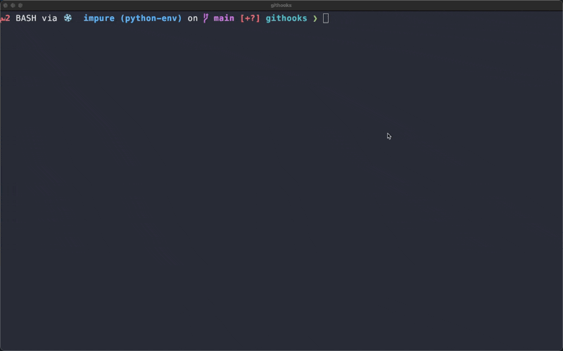

# Containerizing GitHooks

## What is this project

This project contains three sets of prompts.  These represent different stages of improvements
to an assistant that can help developers configure githooks in their project.

```
prompts/
├── git_hooks_with_linguist
│   ├── 010_system_prompt.md
│   ├── 020_user_prompt.md
│   └── README.md
├── git_hooks
│   ├── 010_system_prompt.md
│   ├── 015_system_prompt.md
│   ├── 020_user_prompt.md
│   └── README.md
├── git_hooks_single_step
│   ├── 010_system_prompt.md
│   ├── 015_system_prompt.md
│   ├── 016_system_prompt.md
│   ├── 020_user_prompt.md
│   └── README.md
```

## How to get started

Make sure that your local Docker Desktop engine is running. Besides a running docker engine and access to Docker Hub, no other tools need to be pre-installed.

The default version of scripts below use OPENAI.  To run these tests, you will need to write your OpenAI API key to the a file named `$HOME/.openai-api-key`.

The second argument to each of the scripts below should be the path to the root of a git cloned project.


### githooks

Start by prompting an LLM with a prompt such as:

```
How do I setup githooks?
```

The results are useful but very general and certainly not project specific.

### git_hooks_with_linguist

In the first set of prompts, we add one capability to the LLM.  We give it a tool to do
linguistic analysis on the project and _then_ ask it to setup the githooks.
You can try this verion of the prompts using OpenAI by running.

```sh
./prompts/run_prompts.sh github:docker/labs-githooks?ref=main&path=prompts/git_hooks_with_linguist {root of your project}
```

### git_hooks

We can make the advice even more specific by augmenting the prompts with information about
how we prefer to setup githooks.  See [this example](prompts/git_hooks/015_system_prompt.md) where
we describe how to setup githooks using the [pre-commit](https://github.com/pre-commit/pre-commit) tool.

Run this set of prompts using:

```sh
./prompts/run_prompts.sh github:docker/labs-githooks?ref=main&path=prompts/git_hooks {root of your project}
```

### git_hooks_single_step

Finally, a set of prompts which can takes the LLM response and then calls a function that configures the githooks in the root of your project.
This script will make updates to your .git/hooks folder and add an assistant authored pre-commig-config.yaml file.  It can be run using:

```sh
./prompts/run_prompts.sh github:docker/labs-githooks?ref=main&path=prompts/git_hooks_single_step {root of your project}
```

## Summary

After analyzing the project for different file types and setting up the githooks,
both the `pre-commit` and
`commit-msg` hooks are configured by the assistant. All tools run in containers but even the githooks themselves are containerized.
This allows us to distribute an assistant that relies only on access to trusted set of docker images.




